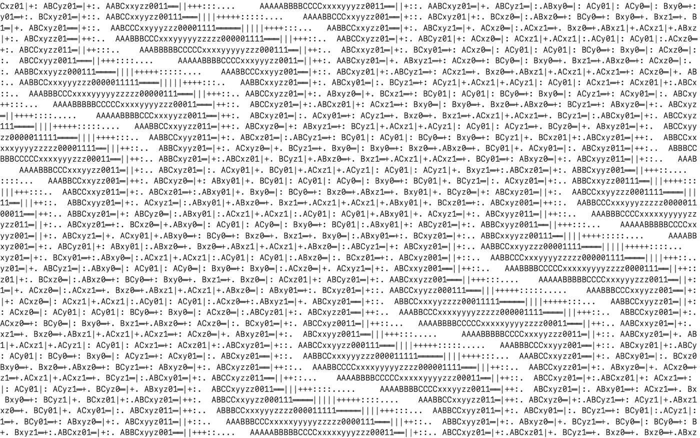

# ASCIISaver

A macOS screen saver of **[Time: milliseconds](https://play.ertdfgcvb.xyz/#/src/basics/time_milliseconds)**
by [ertdfgcvb](https://play.ertdfgcvb.xyz), ported from
[play.core](https://github.com/ertdfgcvb/play.core) to Swift + AppKit.



## Install

```sh
./build.sh --install
```

Then open **System Settings → Screen Saver** and pick *ASCIISaver*. If it was
already selected, switch to another saver and back so the host reloads the
bundle.

Requires Xcode and macOS 14+. [xcodegen](https://github.com/yonaskolb/XcodeGen)
regenerates `ASCIISaver.xcodeproj` from `project.yml` if installed; the checked-in
project works without it.

## Options

Click **Options…** in System Settings:

| Setting | Default | Notes |
| --- | --- | --- |
| Character size | 16 pt | Smaller = denser grid and more cells to draw |
| Colors | Light | Matches the site (black on white). Dark inverts it |
| Frame rate | 30 fps | The play.core default |
| Runtime info overlay | Off | The demo's FPS/frame/time box — a debug readout, so it's off by default |

## How the port works

play.core is a browser runtime that, once per frame, walks a grid of character
cells and asks the program for the character at each coordinate. That model is
reproduced directly, so play.core programs translate almost line for line.

| play.core | Here |
| --- | --- |
| `src/run.js` | `Sources/Runner.swift` — clock, buffer, per-cell loop |
| `src/core/textrenderer.js` (DOM) | `Sources/GridRenderer.swift` — Core Text |
| `src/modules/drawbox.js` | `Sources/DrawBox.swift` |
| `src/programs/basics/time_milliseconds.js` | `Sources/Programs/TimeMilliseconds.swift` |

The program itself is a near-literal transcription:

```swift
let t = context.time * 0.0001
let o = sin(y * sin(t) * 0.2 + x * 0.04 + t) * 20
let i = Int(abs(x + y + o).rounded()) % pattern.count
cell.char = pattern[i]
```

To add another play.core program, conform a type to `Program` and swap it into
`ASCIISaverView.program`.

### Two things that needed solving

**The font.** The site renders in *LL Simple Console*, which is licensed for
`ertdfgcvb.xyz` only, so it can't be bundled. The saver uses the macOS system
monospaced font instead.

That matters more than it looks: an ASCII program's proportions come entirely
from the *cell aspect ratio*, because `main()` is given cell coordinates, not
pixels. Simple Console has a 0.528 em advance and the page sets
`line-height: 1.2`, giving cells a **0.44** width-to-height ratio. A different
font would change the shape of the wave. So `GridRenderer` derives row height
from that constant rather than from the font's own line height:

```swift
let lineHeight = cellWidth / (0.528 / 1.2)
```

The pattern's geometry is therefore identical to the original under any font.

**Throughput.** A 6K display is ~23,000 cells, all of which change every frame,
so per-cell drawing is not viable. `GridRenderer` flattens the grid into one
glyph array per distinct style and issues a single `CTFontDrawGlyphs` call for
each — one draw call total for this program, since it uses a single weight and
color. Cell backgrounds are coalesced into horizontal runs. Measured at 2x
backing scale:

| Display | Cells | Step + render | 30 fps budget |
| --- | --- | --- | --- |
| 16" MacBook Pro | 8,526 | 3.1 ms | 9% |
| 5K / Studio Display | 16,512 | 6.3 ms | 19% |
| 6K Pro Display XDR | 22,800 | 8.5 ms | 26% |

## Deliberate differences from the demo

- **No `cursor` row in the info overlay.** A screen saver has no pointer, and
  moving the mouse dismisses it.
- **Info overlay off by default.** It's a debug readout; the wallpaper is the point.
- The system monospaced font replaces Simple Console, as above.

## License

Apache 2.0, inherited from play.core. See `LICENSE` and `NOTICE`.
Original program and runtime © ertdfgcvb.
# asciisaver
